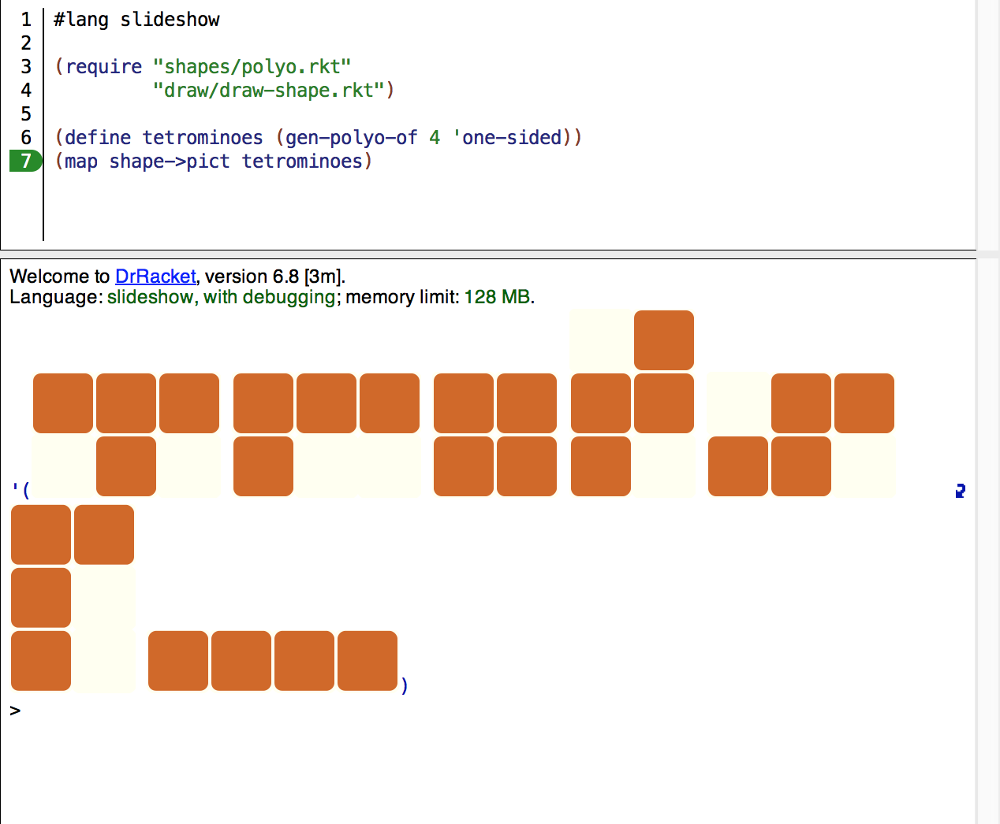

# Polyomino Enumerator Written in Racket

Supported polyomino types:
- fixed
- one-sided
- free

Main functions:

polyomino enumeration:
- (gen-polyo-of n 'free)
- (gen-polyo-upto n 'one-sided)

visualize shapes:
- (shape->pict a-shape)
- (map shape->pict list-of-shapes)
- (deepmap shape->pict nested-list-of-shapes)

## Tetrominoes
The following example (see "run.rkt") generates and visualizes the Tetrominoes as in the game:

```
#lang slideshow

(require "shapes/polyo.rkt"
         "draw/draw-shape.rkt")

(define tetrominoes (gen-polyo-of 4 'one-sided))
(map shape->pict tetrominoes)
```
which displays:


